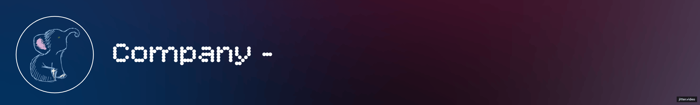

**Company** is a minimal full-screen companion designed to keep you centered, without distractions. Sometimes, you don’t want to shut down your computer — but you also don’t want to be pulled into notifications, open tabs, or apps. At such times Company is there for you, giving a clean, elegant screen that acts like a soft pause button for your digital world.

You can use it when you:

- 📖 Read a book
- 🧹 Clean your room
- 💼 Step away from your desk at work
- 🧘 Take a break from screen overload
- 🎧 Let Spotify run in the background
- 🎓 Study with a Pomodoro timer
- ⏳ Plan a task using the stopwatch

## 🧩 Features

- **Timer**: Plan your focus sessions and breaks with ease.
- **Customizable backgrounds**: Multiple built-in components let you personalize your screen’s look.
- **Time & date display**: Always know where you are in the day, without needing to check your phone.

## 🚀 Tech Stack

- **Built with**: [Tauri](https://tauri.app) & [React](https://reactjs.org)
- **UI Components**: Some components/code from [shadcn/ui](https://ui.shadcn.com) and [React Bits](https://reactbits.dev/)
- **Loading Animation**: Made using [Jitter.video](https://www.jitter.video)
- **Sound Effects**: Startup and alarm sounds from [Pixabay](https://pixabay.com/sound-effects)
- **AI Assistance**: Background selection feature is mostly powered by [Windsurf Code Editor](https://windsurf.com/), with some modifications done later by me.

## 📦 Install, Run & Distribute

### Using the installer

On Windows, you can install Company via the installer in the releases page.

### Cloning the repo

```bash
git clone https://github.com/AlperBayraktar/Company.git
cd Company
npm install
```

### Running localy

```bash
npm run tauri dev
```

### Distributing

Check out the [docs](https://v2.tauri.app/distribute/).

## 🧪 Planned Features

- English language support (probably other languages too with the help of AI)
- Generating installers for macOS and Linux (and testing them)
- Replacing app's logo from Tauri's to Company's
- Background transition animations when changing backgrounds
- More background components (possibly from [React Bits](https://reactbits.dev/) and [Aceternity UI](https://ui.aceternity.com/))
- GPU usage indicator
- A quit button

# Some screenshots

> Coming soon.
